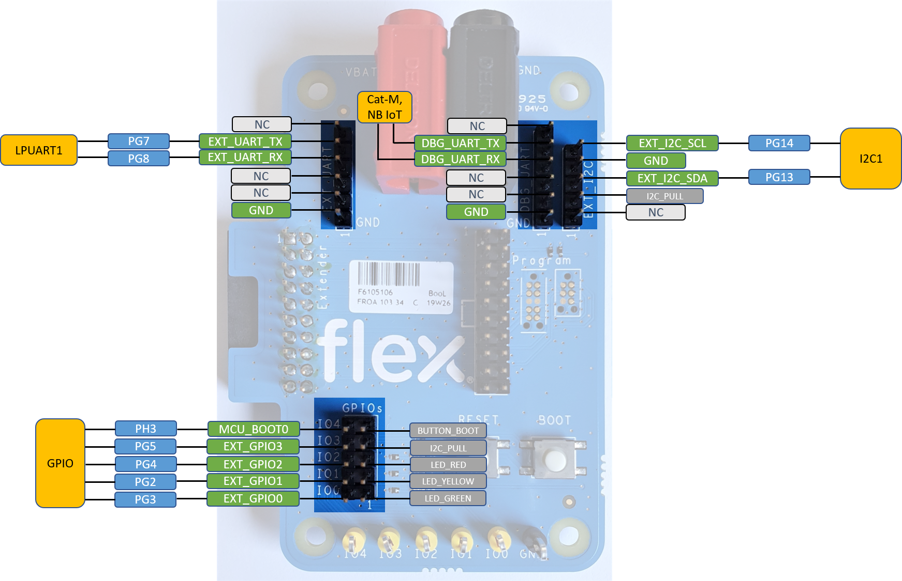

# iENBL-DK_BSP
This repository contains the board support pack (BSP) for the [Flex iENBL](https://flex.com/resources/ienbl) development platform as a [CMSIS-Pack](https://arm-software.github.io/CMSIS_5/Pack/html/index.html).

## Board Features

- STM32L496 ultra-low-power and high-performance MCU (512kB ROM, 320kB RAM)

- Connectivity
  - LTE Cat-M/NB_IoT module
  - GNSS (GPI, GLONAS, GALILEO, BeiDou) module
  - WiFi module
  - BLE module

- USB
  - Micro USB Type-B (OTG 2.0 full speed) Connector

- Mass Storage
  - microSD Card Slot
  - 16M-bit SPI Flash

- Sensor
  - Accelerometer
  - Accelerometer + Gyroscope
  - Digital barometer
  - Ambient Light Sensor
  - Humidity Sensor
  - Digital-Switch Hall Effect Sensor
  - Digital Microphone

- User Interface
  - 2x Push Buttons
  - RGB LED
  - Buzzer

- Expansion Port
  - 20-pin Arm Standard JTAG Connector
  - 6-pin Tag-Connector
  - 10-pin Tag-Connector
  - 2-pin UART header
  - 2-pin UART debug header
  - 2-pin I2C header

## Headers

## CMSIS-Pack directory structure

|Directory|Content|
|---------|-------|
|Documents|Documentation such as user's manual and schematics|
|Drivers  | [CMSIS-Drivers](https://arm-software.github.io/CMSIS_5/Driver/html/index.html) for various interfaces|
|Images   |Images of the platform|
|Projects |Pre-configured example projects|

## License

This BSP is licensed under [Apache-2.0](https://www.apache.org/licenses/LICENSE-2.0).

## Contributions and pull requests

Contributions are accepted under Apache-2.0. Only submit contributions where you have authored all of the code.